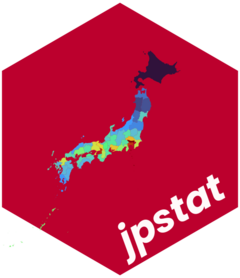

---
format:
  gfm:
    default-image-extension: ""
editor:
  markdown:
    wrap: 72
---

<!-- README.ja.md is generated from README.ja.qmd. Please edit that file -->

```{r}
#| include: false
knitr::opts_chunk$set(
  collapse = TRUE,
  comment = "#>",
  fig.path = "man/figures/README-",
  out.width = "100%"
)
```

# jpstat <a href="https://uchidamizuki.github.io/jpstat/"></a>

<!-- badges: start -->

[](https://CRAN.R-project.org/package=jpstat)

<!-- badges: end -->

*[English](README.md)*

jpstatは，日本政府統計のポータルサイトである
[e-Stat](https://www.e-stat.go.jp/api/) のAPIを利用するためのツールを提供します．

**「このサービスは、政府統計総合窓口(e-Stat)のAPI機能を使用していますが、サービスの内容は国によって保証されたものではありません。」**

## インストール方法

``` r
install.packages("jpstat")
```

jpstatの開発版は，[GitHub](https://github.com/)から以下の方法でインストールできます．

``` r
# install.packages("devtools")
devtools::install_github("UchidaMizuki/jpstat")
```

```{r}
#| message: false
#| warning: false
library(jpstat)
library(tidyverse)
```

## e-Stat API

e-Stat APIの利用にはアカウント登録 (appIdと呼ばれるAPIキーの発行)
が必要です
(詳しくは[ホームページ](https://www.e-stat.go.jp/api/)を参照してください)．
また，データ利用に際しては[利用規約](https://www.e-stat.go.jp/terms-of-use)に従う必要があります．

データ取得・整形の一連の流れは以下のようになります．
ここでは，[社会・人口統計体系](https://www.e-stat.go.jp/dbview?sid=0000010101)を対象として，
2010・2015年の東京都・大阪府における男女別人口を取得します．

```
# APIキーの設定
Sys.setenv(ESTAT_API_KEY = "Your appId")

# メタ情報の取得
ssds <- estat(statsDataId = "https://www.e-stat.go.jp/dbview?sid=0000010101")
ssds
```

```{r}
#| echo: false
ssds <- estat(statsDataId = "https://www.e-stat.go.jp/dbview?sid=0000010101")
ssds
```

```{r}
# 2010・2015年の東京都・大阪府における男女別人口を取得
population <- ssds |>

  activate(tab) |>
  filter(name == "観測値") |>
  select() |>

  activate(cat01) |>
  rekey("sex") |>
  filter(str_detect(name, "総人口（[男女]）")) |>
  select(name, unit) |>

  activate(area) |>
  rekey("pref") |>
  filter(name %in% c("東京都", "大阪府")) |>
  select(code, name) |>

  activate(time) |>
  rekey("year") |>
  filter(name %in% c("2010年度", "2015年度")) |>
  select(name) |>

  collect(n = "population")

knitr::kable(population)
```
